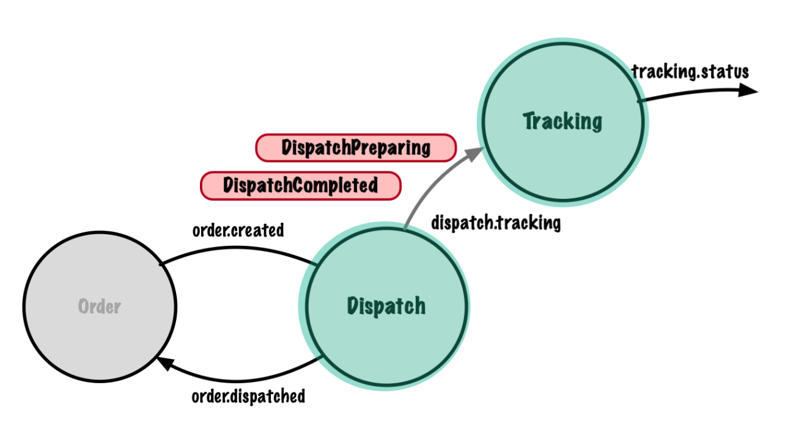

# Introduction to Kafka with Spring Boot - Tracking Service

이 저장소에는 [Spring Boot를 사용한 Kafka 소개](https://www.udemy.com/course/introduction-to-kafka-with-spring-boot/?referralCode=15118530CA63AD1AF16D) 온라인 과정을 지원하는 코드가 포함되어 있습니다. 코스의 추적 서비스 부분.

디스패치 서비스 관련 저장소는 [디스패치 서비스 저장소](https://github.com/lydtechconsulting/introduction-to-kafka-with-spring-boot)에서 찾을 수 있습니다.

애플리케이션 코드는 Kafka 및 Spring Boot 3을 활용하는 메시지 기반 서비스용입니다.

이 저장소의 코드는 학생들이 Spring Kafka 및 Spring Boot 3을 사용하여 Java에서 메시지를 생성하고 사용하는 방법을 배우는 데 사용됩니다.
이 과정은 학생들이 스스로 코드를 구축할 수 있도록 단계별 지침과 자세한 설명을 제공합니다.
이 저장소는 분기를 사용하여 섹션별로 세분화된 과정을 지원하는 코드를 제공하므로 학생들은 다음을 수행할 수 있습니다.
그들이 만든 코드를 브랜치의 수업 코드와 비교하고 대조해 보세요.

과정을 진행하면서 자유롭게 이 저장소를 자신의 GitHub 저장소로 포크해 보세요. 대부분의 강의에는 링크가 포함되어 있습니다.
소스 코드 변경 사항. 문제가 발생하면 코드를 강의 코드와 비교할 수 있습니다. Wiki의 [분기 비교 방법](https://github.com/lydtechconsulting/introduction-to-kafka-with-spring-boot/wiki#how-to-compare-branches) 섹션을 참조하세요.

## Introduction to Kafka with Spring Boot Course Wiki
Spring Boot를 사용한 Kafka 소개 과정에 대한 유용한 정보는 다음에서 찾을 수 있습니다. [Wiki](https://github.com/lydtechconsulting/introduction-to-kafka-with-spring-boot/wiki).


## Getting Your Development Environment Setup
### Recommended Versions
| Recommended                | Reference                                                             | Notes                                                                                                                                                                                                                                                          |
|----------------------------|-----------------------------------------------------------------------|----------------------------------------------------------------------------------------------------------------------------------------------------------------------------------------------------------------------------------------------------------------|
| Apache Kafka 3.3 or higher | [Download](https://kafka.apache.org/downloads)                        |                                                                                                                                                                                    |
| Oracle Java 17 JDK         | [Download](https://www.oracle.com/java/technologies/downloads/#java17) | Java 17 or higher. We recommend using the most recent LTS (Long-Term Support) release                                                                                                                                                                          |
| IntelliJ 2022 or higher    | [Download](https://www.jetbrains.com/idea/download/)                  | Ultimate Edition recommended. Students can get a free 120 trial license, courtesy of the Spring Framework Guru, [here](https://github.com/springframeworkguru/spring5webapp/wiki/Which-IDE-to-Use%3F#how-do-i-get-the-free-120-day-trial-to-intellij-ultimate) |
| Maven 3.6 or higher        | [Download](https://maven.apache.org/download.cgi)                     | [Installation Instructions](https://maven.apache.org/install.html)                                                                                                                                                                                             |                                                                                                                 | **Note:** Use Version 5 or higher if using Java 11                                                                                                                                                                     |
| Git 2.39 or higher         | [Download](https://git-scm.com/downloads)                             |                                                                                                                                                                                                                                                                | 
| Git GUI Clients            | [Download](https://git-scm.com/downloads/guis)                        | Not required. But can be helpful if new to Git. SourceTree is a good option for Mac and Windows users.                                                                                                                                                         |

## Connect with the team at Lydtech Consulting
* Visit us at [lydtechconsulting.com](https://www.lydtechconsulting.com/)
* Visit our [LinkedIn](https://www.linkedin.com/company/lydtech-consulting) page


# 7. Spring Boot Integration Test
## 2. Integration Test Assignment

### 과제
- 스프링 부트 통합 테스트에 필요한 적절한 클래스 주석을 사용하여 추적 서비스에서 새 통합 테스트 클래스를 만든다
- **Tracking.status** 주제 에서 사용하도록 KafkaTestListener를 설정합니다 . 리스너는 메시지가 소비될 때마다 카운터를 증가
- 스프링 컨텍스트에 리스너를 추가하고 통합 테스트에 자동 연결
- **테스트는 DispatchPreparing 이벤트를 dispatch.tracking** 주제 로 보내 므로 KafkaTemplate을 통합 테스트 클래스에 자동으로 연결해야 함
- 테스트에서 Awaitility 테스트 라이브러리를 사용하여 KafkaTestListener에 정의된 메시지 수신 횟수가 증가할 때까지 기다림
- 리스너의 파티션이 할당될 충분한 시간을 갖도록 BeforeEach 테스트 설정 방법을 추가
- 내장된 Kafka 브로커 주소를 지정하기 위해 application-test.properties 파일을 생성

### 질문
- 테스트 클래스를 통합 테스트로 표시하기 위해 어떤 주석을 사용했나요?
    - 통합 테스트를 정의하려면 `@SpringBootTest` 주석을 사용해야 합니다. Spring 애플리케이션 컨텍스트를 부트스트랩하고 Spring 빈을 인스턴스화합니다
- 통합 테스트에서 Kafka 인메모리 브로커 사용을 활성화하기 위해 어떤 주석을 사용했나요?
    - `@EmbeddedKafka` 주석은 인메모리 Kafka 브로커 인스턴스를 통합 테스트에 삽입하는 데 사용해야 합니다
- 추적 서비스에 대한 처리 흐름을 시작하기 위해 어떤 주제에 메시지를 보냈습니까?
    - DispatchPreparing 이벤트를 `Dispatch.tracking` 주제로 보내야 합니다. 이는 추적 서비스가 메시지를 소비하는 주제이기 때문입니다
- 주제 파티션이 할당될 충분한 시간이 있고 소비자가 테스트에서 전송된 이벤트를 사용할 준비가 되었는지 어떻게 확인했습니까?
    - `@BeforeEach` 주석이 달린 설정 메서드를 사용한 다음 `ContainerTestUtils.waitForAssignment` 도우미 메서드를 사용하여 각 컨테이너에 파티션이 할당될 때까지 기다려야 합니다.
- 추적 서비스가 처리 흐름을 성공적으로 완료했음을 어떻게 증명했나요?
    - 메시지가 `Tracking.status`로 전송되면 추적 서비스가 DispatchPreparing 메시지를 성공적으로 처리한 것입니다. 따라서 통합 테스트는 추적 상태 주제 메시지 카운터가 증가할 때까지 최대 몇 초 동안 기다려야 합니다

```bash
bin/kafka-console-producer.sh --bootstrap-server localhost:9092 --topic dispatch.tracking
>{"orderId":"7c4d32e9-4999-434b-953a-9467f09b023f"}
```

# 11. Assignment Multiple Event Type

이 과제에서는 서비스가 `dispatch.tracking` 주제 에 대한 여러 이벤트 유형을 처리할 수 있도록 하는 방법을 모색하고 있다



#### 예상되는 변화
새 서비스를 생성하고 테스트하는 데 필요한 모든 코드와 단계는 이전 모듈에서 다루었다

**파견 서비스**
`dispatch.tracking` 이라는 새 주제에 대해 `DispatchCompleted` 이벤트를 내보내는 디스패치 서비스
`DispatchCompleted` 이벤트의 페이로드는 다음과 같다

1. 주문 ID : UUID
2. 날짜 : 문자열

날짜 필드의 유일한 목적은 `DispatchCompleted` 이벤트와 `DispatchPreparing` 이벤트를 구별하는 것

**추적 서비스**
추적 서비스는 이제 새로운 `DispatchCompleted` 이벤트를 소비하고 차례로 새로운 상태 'COMPLETED'로 `TrackingStatusUpdated` 이벤트를 내보내도록 변경해야 함

추적 서비스는 단일 주제에서 여러 이벤트 유형을 사용한다. 이를 위해서는 특히 `@KafkaListener` 및 `@KafkaHandler` 주석 사용과 관련하여 소비자의 재작업이 필요

**테스트**
두 서비스 모두에 대한 변경 사항에는 단위 테스트 적용 범위가 있어야 한다

**통합 테스트**
`DispatchCompleted` 이벤트를 테스트하려면 추적 서비스 통합 테스트를 업데이트해야 한다

Dispatch Service의 통합 테스트는 `dispatch.tracking` 주제의 소비자 역할을 하므로 Tracking Service 핸들러에서 구현된 것과 유사하게 여러 이벤트를 처리하기 위한 변경도 필요하다

디스패치 서비스 통합 테스트에서는 통합 테스트의 `waitForAssignment` 메소드를 업데이트해야 한다. 이제 두 개의 애플리케이션 리스너 컨테이너가 있다. 하나는 애플리케이션용이고 다른 하나는 테스트 자체용이며, 다른 수의 주제를 수신하는 것을 고려해야 한다. 다음 코드는 수행해야 할 변경 사항을 보여준다

```java
ContainerTestUtils.waitForAssignment(container, container.getContainerProperties().getTopics().length * embeddedKafkaBroker.getPartitionsPerTopic()));
```

#### 이 과제에 대한 질문
1. `Dispatch.tracking` 주제에서 `DispatchPreparing` 및 `DispatchCompleted` 이벤트를 모두 사용할 수 있도록 추적 서비스 핸들러의 주요 변경 사항은 무엇입니까?
  - 동일한 주제에서 여러 이벤트 유형을 사용하기 위해 `@KafkaListener` 주석이 클래스 수준으로 이동되고 각 이벤트 유형에 대해 하나씩 두 개의 청취 메서드에 `@KafkaHandler` 주석이 추가된다
2. 들어오는 이벤트의 Java 유형 표현을 신뢰할 수 있는지 어떻게 확인했습니까?
  - 이제 수신 주제에 여러 이벤트 유형이 있으므로 `ConsumerFactory`의 기본 유형 구성을 제거해야 했다. 그 자리에 `JsonDeserializer.TRUSTED_PACKAGES` 구성이 추가되어 Spring Kafka가 신뢰할 수 있는 이벤트 유형의 Java 표현 위치를 알 수 있다.